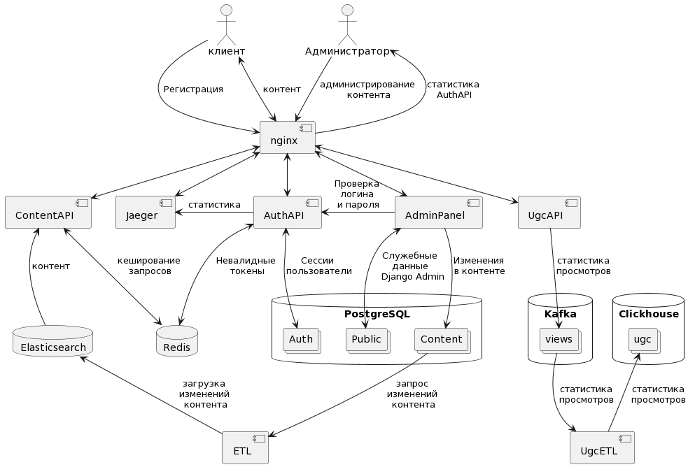

## Ссылка на репозиторий
[https://github.com/tikhonov1994/Auth_sprint_1](https://github.com/tikhonov1994/Auth_sprint_1)

  

## Запуск

Сервисы подготовлены для развертывания в docker, для этого необходимо:
1. Расположить копию файла `.env.example` в корне проекта, сохранив ее с именем `.env`. Переменные уже имеют валидные значения, и все должно заработать из коробки.
2. Развернуть контейнеры командой `docker-compose --profile all up -d`  
3. Благодаря наличию профилей можно запускать сервисы отдельно. К примеру, можно запустить сервис авторизации и сервис пользовательского контента с помощью команды `docker-compose --profile auth --profile ugc_api up -d --build`. Ниже приведен список профилей для сервисов:
   1. `api` - сервис контента.
   2. `etl` - сервис перегрузки контента в эластик.
   3. `ugc_etl` - сервис перегрузки данных из кафки в кликхаус.
   4. `auth` - сервис авторизации.
   5. `admin` - админ-панель.
   6. `ugc_api` - сервис пользовательского контента.
   7. `social_api` - сервис лайков и рецензий.
   8. `email_handlers` - сервисы отправки email-уведомлений.
   9. `notification_api` - сервис апи-прослойка для отправки сообщений.
   10. `user_api` - сервис профайлов юзеров.
4. OpenAPI сервисов станут доступны по адресам: `http://localhost/content/api/openapi/` для сервиса выдачи контента, и `http://localhost/auth/api/openapi/` для сервиса авторизации. 
5. Jaeger UI будет доступен по адресу `http://localhost/`.  

По-умолчанию, в сервисе авторизации создается суперпользователь, почта и пароль которого указаны в переменных окружения `AUTH_ADMIN_EMAIL` и `AUTH_ADMIN_PASSWORD`.  
Помимо этого, всегда можно создать нового суперпользователя с помощью консольной команды. Для этого необходимо перейти в консоли в корень сервиса auth (`./auth/`) и выполнить поманду: `python create_superuser.py su@admin.com su_password`, подставив в качестве параметров почту и пароль для нового суперпользователя.  
  

## Тестирование

Тестирование сервисов вынесено в отдельный контейнер. Чтобы запустить тестовую среду и сами тесты, нужно развернуть ее командой `docker-compose -f tests.docker-compose.yml --profile all up -d`. Обратите внимание, что для корректного запуска в корне проекта должен располагаться скопированный ранее файл `.env`. Помимо этого, необходимо выставить в этом файле значение переменной `EXPORT_LOGS=False`.  
Результаты выполнения тестов можно посмотреть в логах докера: `docker logs tests`.   
